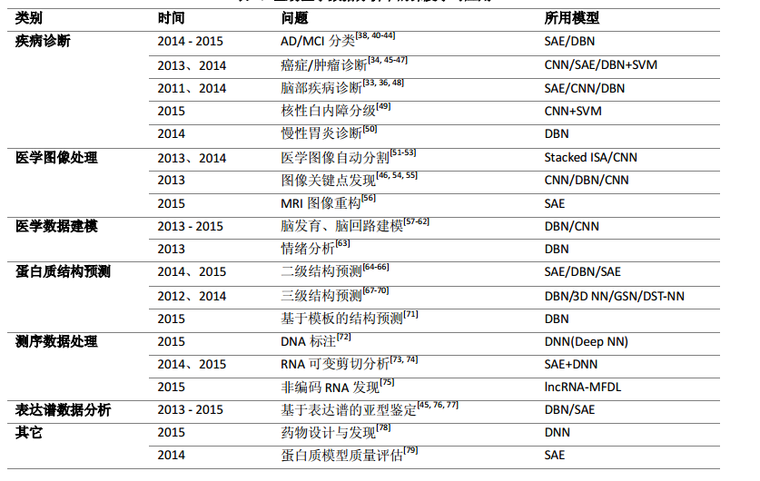

# 生物医学数据分析中的深度学习方法应用(阅读笔记)

## 1 深度学习方法

- 深度信念网络 DBN
- 堆叠自动编码器 SAE
- 卷积神经网络 CNN
## 2 生物医学数据分析中的深度学习应用
### 1.  医疗数据分析中的深度学习应用
-  疾病诊断
- 医学图像处理
- 医学数据建模

表 1：生物医学数据分析中的深度学习应用

###  2. 生物数据分析中的深度学习应用
- 蛋白质结构预测
- 测序数据处理 
&emsp; 2014 年，多伦多大学的 J. Frey 等人通过构建深度神经网络[73, 74]，分析 mRNA 的组织特异性剪切模式及可变剪切与人类疾病的关系，该模型的表现优于同一团队之前采用贝叶斯网络的结果. 
&emsp; 2015 年，Quang 等建立了一个五层深度网络[72]，将基因突变的相关特征作为输入，来判断它是否为致
病基因，该模型对编码区和非编码区的序列数据均有效，相较之前的 SVM 模型，其 AUC 有 0.09 的提升.
- 表达谱数据分析

##  3 深度学习模型构建及训练
1. 模型构建
2. 模型训练
3. 深度学习应用的步骤
4. 深度学习工具的使用
## 4 展望

未完待续 
